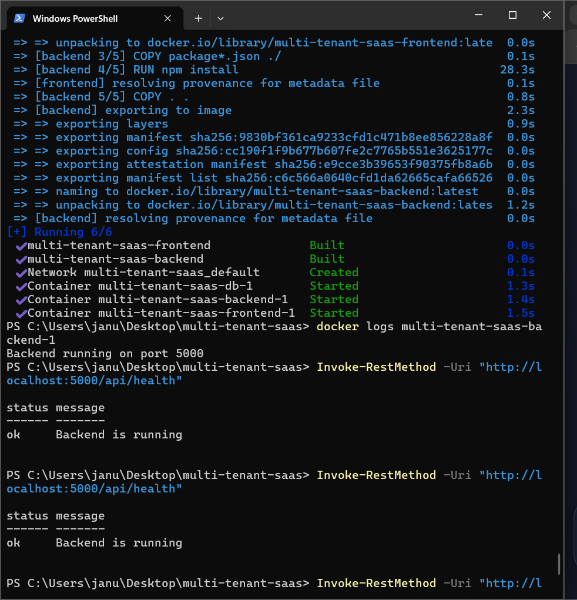
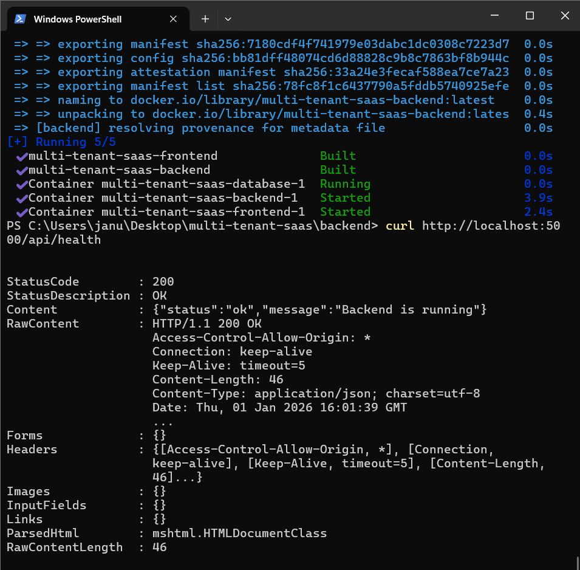
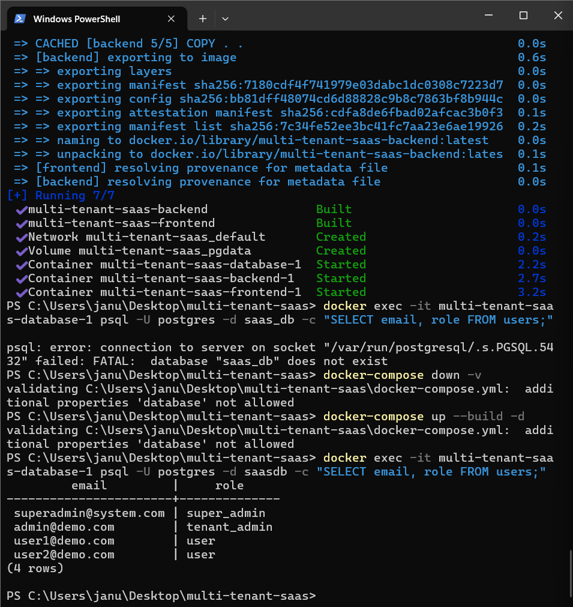
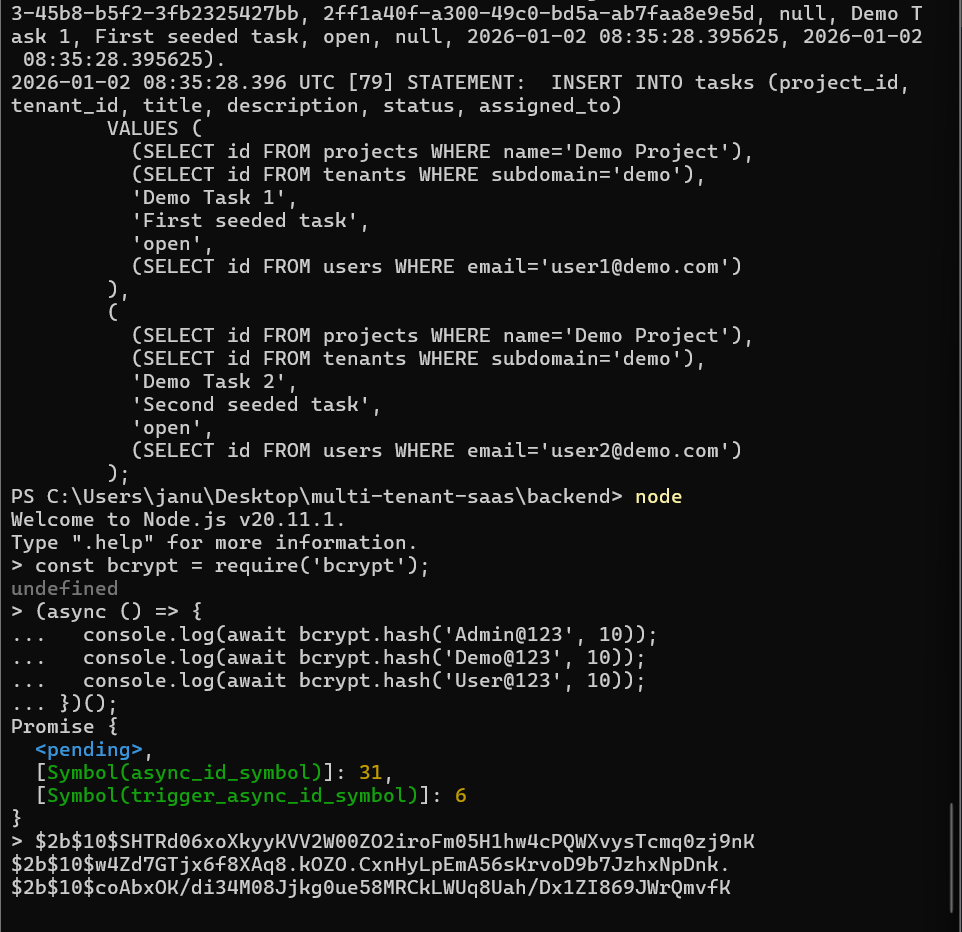

# Multi-Tenant SaaS Platform

## Overview
This project is a portfolio-ready multi-tenant SaaS application built with:
- **Backend**: Node.js, Express, PostgreSQL  
- **Frontend**: React  
- **Database**: PostgreSQL with seeded demo data  
- **Deployment**: Docker Compose (backend, frontend, database services)  

It demonstrates authentication, tenant management, project and task APIs, and role-based access control (RBAC).

---
## Highlights - 🚀 End-to-end SaaS application with **backend + frontend integration** - 🐳 Fully **Dockerized deployment** (backend, frontend, database) - 🗄️ **Seeded demo data**: tenants, users, projects, tasks - 🔐 **Role-Based Access Control (RBAC)** enforced (admin vs user) - 📸 Backend proof with screenshots (health, Docker startup, seeded users, seeded tasks, DB tables, tenants, API test) - 🖥️ Frontend proof documented (login, projects, tasks, RBAC integration) - 📑 Professional README with clear setup, APIs, and proof of functionality


## Features
- Multi-tenant architecture  
- Authentication (`/api/auth/login`, `/api/auth/register-tenant`)  
- Projects API (CRUD)  
- Tasks API (CRUD)  
- Role-based access control (RBAC)  
- Dockerized deployment  

---

## Setup Instructions
```bash
git clone https://github.com/your-repo/multi-tenant-saas.git
cd multi-tenant-saas
docker-compose up --build -d
```

Backend runs on **http://localhost:5000**  
Frontend runs on **http://localhost:3000**

---

## API Endpoints

### Health
- `GET /api/health`

### Auth
- `POST /api/auth/login`  
- `POST /api/auth/register-tenant`

### Projects
- `POST /api/projects` (admin only)  
- `GET /api/projects`  
- `PUT /api/projects/:id`  
- `DELETE /api/projects/:id`

### Tasks
- `POST /api/tasks` (admin only)  
- `GET /api/tasks`  
- `PUT /api/tasks/:id`  
- `DELETE /api/tasks/:id`

---

## Role-Based Access Control
- **tenant_admin** → can create, update, and delete projects and tasks  
- **user** → can only view projects and tasks  

---

## Backend Proof

### Health Check


### Docker Startup


### Health Check with HTTP Response


### Seeded Users & Roles


### Seeded Tasks & Password Hashing


### Database Tables


### Tenants Table


### Backend API Test


---

## Frontend Proof

The React frontend runs on **http://localhost:3000** and connects to backend APIs at **http://localhost:5000**.  

### Key Features
- **Login Page**  
  - Admins log in with `admin@demo.com` / `Demo@123`  
  - Users log in with `user1@demo.com` / `User@123`  
- **Projects Page**  
  - Admins can create, update, and delete projects  
  - Users can only view projects  
- **Tasks Page**  
  - Admins can create, update, and delete tasks  
  - Users can only view tasks  
- **RBAC Enforcement**  
  - Admins see create/edit/delete options  
  - Users see read‑only views  

### Integration Proof
- Frontend startup confirmed at `localhost:3000`  
- Login flow validated against seeded users in PostgreSQL  
- Projects fetched from `/api/projects`  
- Tasks fetched from `/api/tasks`  
- RBAC enforced: user attempts to create → “Forbidden” response  

---

## Conclusion
This repository demonstrates a complete SaaS application with:
- ✅ Backend APIs, seeded database, and RBAC enforcement  
- ✅ Dockerized deployment with reproducible setup  
- ✅ Frontend integration with authentication, projects, and tasks  

