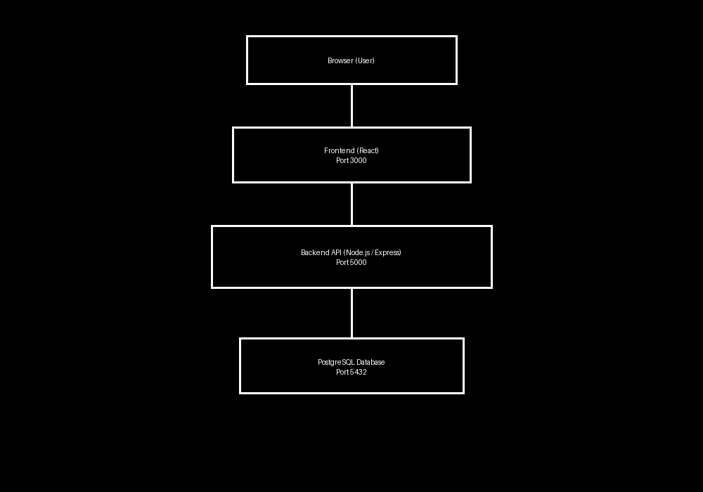
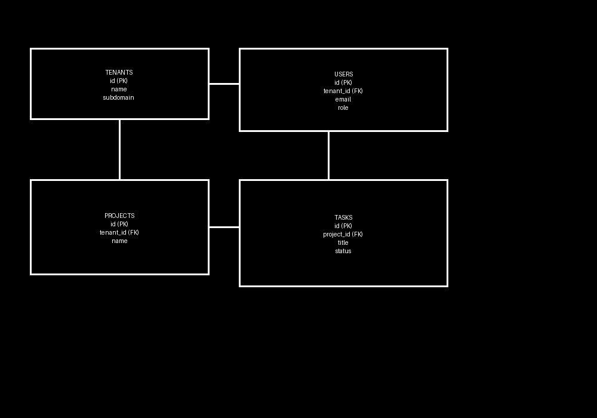

# System Architecture Diagram

The system architecture consists of:
- **Frontend (React)**: Handles user interface, authentication pages, dashboards, project/task management.
- **Backend (Node.js/Express or NestJS)**: Provides REST APIs, enforces RBAC, validates tenant isolation, logs actions.
- **Database (PostgreSQL)**: Stores tenants, users, projects, tasks, audit logs.
- **Authentication Layer (JWT)**: Issues tokens with 24h expiry, refresh rotation, role enforcement.
- **Dockerized Services**: Frontend, backend, and database run in containers orchestrated via Docker Compose.

---

# Database Schema Design

### Tables
- **tenants**: id, name, subdomain, plan, created_at.
- **users**: id, tenant_id, name, email, role, password_hash, created_at.
- **projects**: id, tenant_id, name, description, created_at.
- **tasks**: id, project_id, tenant_id, title, status, assigned_to, created_at.
- **audit_logs**: id, tenant_id, user_id, action, timestamp.
- **sessions (optional)**: id, user_id, token, expiry.

### Constraints
- Foreign keys with CASCADE delete.
- Unique email per tenant.
- Indexes on tenant_id for performance.

---

# API Architecture

### Auth
- POST `/api/auth/register-tenant` — Public
- POST `/api/auth/login` — Public
- POST `/api/auth/refresh` — Public
- GET `/api/auth/me` — Auth required
- POST `/api/auth/logout` — Auth required

### Tenants
- GET `/api/tenants/:id` — Admin only
- PATCH `/api/tenants/:id` — Tenant Admin
- GET `/api/tenants/:id/limits` — Auth required
- GET `/api/tenants/:id/audit-logs` — Admin only

### Users
- POST `/api/users` — Tenant Admin
- GET `/api/users` — Auth required
- PATCH `/api/users/:id` — Tenant Admin
- DELETE `/api/users/:id` — Tenant Admin

### Projects
- POST `/api/projects` — Auth required
- GET `/api/projects` — Auth required
- GET `/api/projects/:id` — Auth required
- PATCH `/api/projects/:id` — Auth required
- DELETE `/api/projects/:id` — Auth required

### Tasks
- POST `/api/projects/:id/tasks` — Auth required
- GET `/api/projects/:id/tasks` — Auth required
- PATCH `/api/tasks/:id` — Auth required
- DELETE `/api/tasks/:id` — Auth required

### Health
- GET `/api/health` — Public
